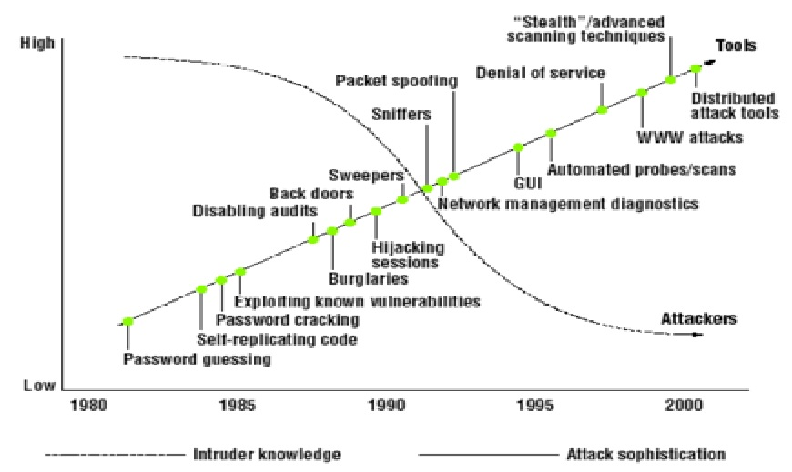
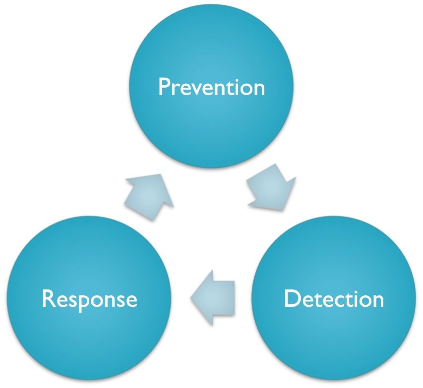
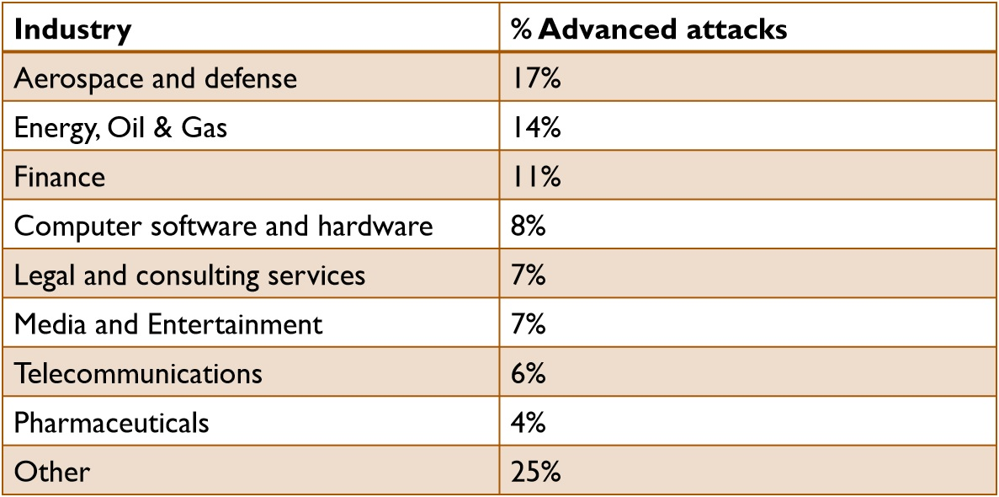
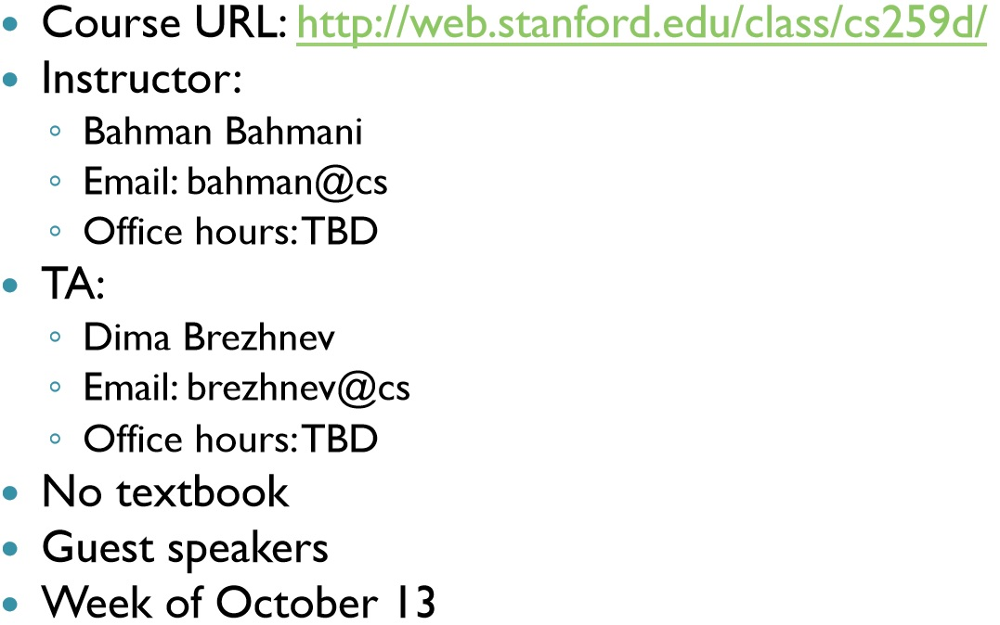

# Introduction

## 网络安全
- 信息安全应用于计算机、智能手机等计算设备以及计算机网络
- 信息安全(InfoSec):防止未经授权的访问、使用、泄露、破坏、修改、读取、检测、记录或销毁信息的实践

## 信息安全的目标
- C-I-A 三合一原则
   - 保密性(Confidentiality)：未授权信息泄漏
   - 完整性(Integrity): 未授权的信息修改
   - 有效性(Availability)：未授权的信息或资源拦截
- 其他
   - 私密性
   - 可靠性
   - 不可否认
   - 可说明
   - 可审核

## 风险管理：控制
- 管理方面
   - 策略，指导
      - 密码测略
      - 支付卡行业数据安全标准(PCIDSS)
      - 最低权限原则
- 物理方面
   - 通道，锁
   - 责任分离原则
- 逻辑方面
   - 会用软件和数据

## 预防方法
- 协议
   - SSL：资源认证
- 基于主机保护的原则
   - 安全操作系统，补丁
- 访问控制
   - 身份识别：用户名
   - 认证：你知道的/拥有的/是的东西？？？
   - 授权：
      - 文件权限
      - Kerberos授权协议(身份证明协议)
      - Need-to-know原则(进程可以随时访问已被授权访问且当前需要完成任务的资源。重要的是，它限制了故障进程对系统可能造成的损害。)
   - 防火墙：控制网络流量(互联网上下行)
   - 安全设计：最低权限原则，代码审查，单元测试，纵深防御？
   - 代码安全：
      - 缓存溢出
      - 格式化字符串漏洞(通过print函数使程序崩溃，内存泄漏或更改)
      - 代码或指令注入

## 为什么预防是不够的
- 越来越复杂的网络和系统会遗传很多弱点
   - 较弱的设计
      - 软件和硬件
      - 例子：发送邮件(竞争条件漏洞<多个线程同时访问同一资源没有进行锁操作或者同步操作的漏洞>，缓冲区溢出，组权限漏洞等)
   - 较弱的实现
      - 安全马后炮
      - 人员缺少培训
      - 弱的系统配置
         - 例如：防火墙开放了不安全的端口
   - 较弱的管理
      - 不足的策略和规则
- 安全性与可用性之间的权衡
- 在系统中非技术的权衡
   - 社会，组织，经济，监督，法律
- 预防的成本

## 缺陷
- 后门
   - Kleptographic攻击 (一种使用非对称加密技术来实现秘钥后门的攻击，例如攻击者使用自己私钥生成的公钥生成目标的私钥)
   - Rootkit (一种系统内核级病毒木马，其进入内核模块后能获取到操作系统高级权限，从而使用各种底层技术隐藏和保护自身，绕开安全软件的检测和查杀)
- 拒绝服务
   - 资源枯竭
   - 攻击放大器？（例如：弱FTP或DNS设计）
   - 应用程序或操作系统漏洞
- 窃听
   - 在网络上监听私人通话
   - 监听硬件电磁传输
- 漏洞
   - 获取计算机系统控制权，允许权限提升，或拒绝服务攻击
   - 用在特洛伊木马，病毒上
- 社会工程
   - 人类：安全方面最薄弱的环节

## 攻击类别
- probe
   - 信息收集 (1:1, 1:m, m:1, m:n modes) 
   - IP扫描，端口扫描，Nmap(一种linux系统网络扫描攻击)
-  Denial of Service (Dos)
   - TCP-SYNFlood攻击 (TCP-SYN Flood攻击又称半开式连接攻击,TCP-SYN Flood只实现TCP三次握手的前两个步骤，由于一台服务器可用的TCP连接是有限的，如果恶意攻击方快速连续地发送此类连接请求，则服务器可用TCP连接队列很快将会阻塞，系统资源和可用带宽急剧下降，无法提供正常的网络服务，从而造成拒绝服务)
   - ping of death (畸形报文攻击，ping of death 攻击 是通过在最后分段中，改变其正确的偏移量和段长度的组合，使系统在接收到全部分段并重组报文时总的长度超过了65535字节，导致内存溢出，这时主机就会出现内存分配错误而导致TCP/IP堆栈崩溃，导致死机)
   - Smurf攻击(Smurf攻击通过使用将回复地址设置成受害网络的广播地址的ICMP应答请求(ping)数据包，来淹没受害主机，最终导致该网络的所有主机都对此ICMP应答请求做出答复，导致网络阻塞。更加复杂的Smurf将源地址改为第三方的受害者，最终导致第三方崩溃)
- Remote to Local attacks (R2L) 
   - Brute force/Dictionary attack：利用字典的暴力破解攻击
   - 缓存溢出
   - unverified input attacks ???
   - 社会工程
   - 木马
- User to Root attacks (U2R) 
   - 缓存溢出， Rootkit
- 感染
   - 木马，蠕虫，病毒
   - 扩散攻击

## 基本的攻击步骤
- 准备
   - 搜集信息：合法的IP和端口，操作系统，软件了类型和版本
- 利用
- 留在后面？？？
   - 后门
- 清理
   - 重新启动崩溃的守护程序，清理注册表/日志文件
- 可变顺序和过程中？？
   - 攻击者的技能水平
   - 漏洞了用类型
   - 先验知识 ？？
   - 攻击的起始位置

## 攻击工具
- 信息收集
   - 嗅探：监视网络数据包并且过滤出敏感数据
      -  Tcpdump, Ethereal, Gulp, Net2pcap, Dsniff
   - 网络映射/扫描/指纹：主机/ IP /端口，协议详细信息
      - Nmap, Amap, Vmap, Ttlscan, P0f, Xprobe, Queso
- 发起攻击
   - 木马
      - Danger, NukeNabbler, AIMSpy, NetSpy
   - DoS攻击
      - Targa, Burbonic, HOIC, LOIC
   - 发包工具
      - Packeth, Packit, Packet Excalibur, Nemesis, Tcpinject, Libnet, SendIP
   - 应用层工具
      - Code Red Worm, Nimda Worm, AppDDoS, RefRef
   - 用户攻击工具？？
      - Ntfsdos, Yaga

## 防守失败
- 不断进攻变得越来越容易
   - 所需专业知识减少
   - 攻击工具的质量不断提高

- 攻击机制不断发展/变异
- 新的连接选项绕过外围安全性 ??
- 防守方法过时
   - 对目前的防病毒软件有抵抗力的多态病毒

## 安全方法

   
## 纵深防御
- 分层方法
   - 将系统分离进网络的不同部分
   - 在系统边界放置防火墙
   - ISP和防火墙之间的边界路由器以过滤流量
   - 交换机在每个部分以使探嗅影响降低
   - 加密
- 最后一层防御
   - 侦测

## 侦测的安全
- 第一代: 入侵检测系统(IDS)
   - 100%的保护/预防是不可能的
   - 分层安全
- 第二代: 安全信息和事件管理(SIEM)
   - 关联来自不同入侵检测传感器的警报
   - 向安全分析师提供可操作的信息
- 第三代: 安全大数据分析
   - 上下文安全情报
   - 长期相关

## 为什么是现在
- 进攻的现状
   - 攻击越来越复杂
   - 攻击者的知识要求越来越低
   - 动机强烈的攻击者
      - 进攻者只需要一次成功，而防守者每次都必须正确
- 当前的检测技术失败
   - 多态的恶意软件
   - zero-day attack(“零日漏洞攻击”又叫零时差攻击，也有翻译为“初始攻击”，“瞬时攻击”，即安全补丁与瑕疵曝光的同一日内，相关的恶意程序就出现，并对漏洞进行攻击。)
   - APTs
- Network perimeter dissolving
   - 移动网络
   - 云
- 大数据技术可存储和分析更大容量和更多类型的数据
- 2010年Verizon数据泄露调查
   - 在86％的违规案件中，在日志中有证据记录
   - 检测机制未能发出警报
- 我们如何理解数据？

## 进攻的现状
- 只有两种类型的公司：被黑客入侵的公司和将要被黑客入侵的公司。 即使是这样，它也被归为一类：那些已经被黑客入侵并且将会再次出现的黑客。--- Robert Mueller (FBI Director )

## 进攻者和动机
- 脚本小子
   - 出于好奇心
- 网络犯罪分子
   - 出于利益
   - 典型群体: 东欧，巴西
- 国家队黑客
   - 出于权力
   - 典型群体: 东亚，中东
- 黑客主义者
   - 出于意识形态
   - 典型群体: 北美，西欧
- 网络雇佣兵
   - 受雇攻击
- 内部人士
   - 出于不满的动机

## 反应防御
- 例子:
   - 已知恶意可执行文件的防病毒签名
   - 垃圾邮件过滤器
   - 遭入侵网站的网络过滤器
   - 恶意行为沙箱
- 从入侵/违反到感知的中位数检测时间：300-400 +天
- 零日攻击的持续时间
   - 19天到30个月
   - 中位数为8个月，平均为10个月
- 第三方发现的攻击中有61％
- 企业不愿透露其入侵行为
   - 只有2%-30%
- Porous perimeter ???
   - 云应用
   - 手机/ BYOD（Bring Your Own Device)指携带自己的设备办公
   - 合作伙伴

## 恶意软件爆炸
- 2011年有4.03亿个恶意软件的新变种
- 2012年第一季度，McAfee每天收集100,000个独特的恶意软件样本
- 到2012年第三季度，McAfee恶意软件签名数据库中的样本已超过1亿个
- 几乎无法跟上签名

## 被攻击的行业

## 一些最近的攻击事件
- 2006年: 美国NIPRNet军事网络丢失了10-20TB数据
- 2007年: 针对爱沙尼亚的大规模网络攻击
- 2008年: 埃克森美孚，康菲石油，马拉松石油。直到联邦调查局（FBI）发出警报时才发现
- 2010年:
   - 针对Google及其它20多个其他公司（例如Yahoo，Morgan Stanley，赛门铁克，诺斯罗普·格鲁曼公司）的Aurora行动
   - Stuxnet: “世界上最先进的恶意软件”
- 2011年:
   - RSA SecurID漏洞，洛克希德·马丁公司因此受到攻击
   - Comodo，DigiNotar证书权限被破解
- 2012年: 火焰被认为是有史以来最复杂的恶意软件，红色十月
- 2013年:
   - Adobe破解: 1.52亿客户数据（包括密码被盗）
   - 目标破解: 4000万张信用卡，7000万个地址，电话号码等，用于应对违规行为的支出为6100万美元，潜在成本为10亿美元
- 2014:
   - eBay违规
   - 家得宝(Home Depot)违规: 5,600万张信用卡和借记卡被盗
   - 摩根大通，其他4家银行: 包括检查和储蓄帐户信息在内的数GB数据被盗

## 高级的持续性威胁: APT
- 针对高价值资产的定向攻击
- 低速而缓慢
- 防止报警:
   - 使用窃取的用户凭证
   - 零时差攻击
   - 在网络中不明显
   - 缓慢的进程: 操作数月甚至数年
   - 超过IDS(入侵检测系统)有限的关联时间窗口
- 多阶段
   - 探索
   - 命令和控制
   - 横向运动
   - 攻破
- 典型的目标
   - 窃取知识产权(IP)
   - 获取敏感客户数据
   - 访问战略业务信息
      - 经济利益、丑闻、勒索、数据毒害、非法内幕交易、扰乱组织业务
- 攻击者
   - 资金充足
   - 高技术
   - 目的明确
   - 针对特定组织的特定数据

## 课程管理

## 评分

## 检测分类  ？？
- 信息源
- 分析策略
- 时间方面  
- 主观能动性
- 连续性

## 检测分类: 信息源
- 基于主机
   - 系统调用，系统日志
- 基于网络
- 无线网络
- 应用日志
   - 数据库日志，Web日志
- IDS(入侵检测系统)传感器警报
   - 低水平的传感器报警

## 