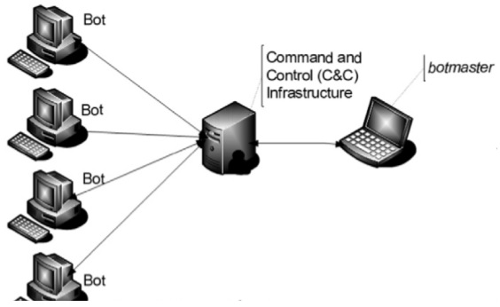

# 僵尸网络

## 僵尸网络
- 由恶意软件组成的机器的网络
- 估计有16-25%的电脑是僵尸网络的一部分
   - Rustock僵尸网络有超过100万个僵尸机器
   - 风暴僵尸网络是“世界顶级超级计算机”之一
- 应用
   - 信息和身份盗取
   - DDoS攻击
   - 软甲盗版
   - 垃圾/钓鱼
      - 大约80%是通过邮件通道传播
      - 例如： Grum, Cutwail, Rustock 
   - 地下经济
      - 1万个机器15美元
   - 危害的规模（对比国际电信联盟？？？）
      - 2006年对全球经济的直接损失达132亿美元
      - 2005年对美国企业造成的直接和间接损失达672亿美元
      - 2007年全球垃圾邮件成本:全球1000亿美元，美国350亿美元

## 开始点
- 因特网中继聊天(IRC)
   - 基于文本的聊天系统
   - 在频道中组织交流
   - 僵尸网络控制IRC聊天室中的交互
      - 解释简单的命令
      - 提供管理支持
      - 提供简单的游戏/服务
      - 检索信息：操作系统，登录次数，邮件等
   - 第一个IRC机器人：Eggdrop, 1993 

## 僵尸网络的组件
- 僵尸电脑
   - 高传输速率
   - 安全性低
   - 距离远
   - 大部分是Windows系统

## 僵尸网络的生命周期
- 初步传染
   - 传染网站，邮件附件，可移动媒体
- 二次传染
   - 主机下载&可运行二级制文件，变成一台肉机
   - 通过FTP, HTTP, or P2P 
- 连接或恢复
   - 与C＆C建立联系的过程
   - 发生在每次机器重启时
- 恶意的活动
   - 肉机和C&C之间的消息交换更加频繁
- 维护和升级

## 僵尸网络C＆C拓扑结构
- 星形
- 多服务器
- 分层的
- 随机的

## 星形C＆C拓扑结构
- 中心的C&C与所有肉机沟通
- 使用的协议
   - IRC
      - C&C功能的SDBot, GTBot, Agobot仍在使用
         - 源码已经被作者开源
   - HTTP
      - 混入正常的用户流量
      - Do-it-yourself kits 
   - 即时通讯(IM)协议
      - ICQ, AIM, MSN Messenger
      - 需要为每个肉机创建一个帐户
- 优点：
   - 控制速度快
- 缺点：
   - 会单点失效

## 多服务器的C＆C拓扑结构
- 星形拓扑结构的拓展
- C&C服务器在它们之间直接相互沟通
- 优点：
   - 不会单点失效
   - 地区优化型
- 缺点：
   - 需要操作者更多的规划/工作

## 分层的C＆C拓扑结构
- 一组肉机充当服务端
   - 静态路由的IP地址
   - 代理C&C指令送给客户端肉机
- 变种：Hierarchical Kademlia (是一种通过分散式杂凑表实现的协议算法)
   - 一组机器人集群
   - P2P用于集群内通信
   - 集群间通信:超级肉机节点
- 优点：
   - 僵尸网络识别:拦截僵尸网络不会枚举所有成员，不太可能揭示出C&C
   - 易于转售
      - 将僵尸网络的部分出租/转售给其他运营商
- 缺点：
   - 命令延迟：不适合实时活动

## 随机拓扑结构
- 没有中心的C&C
   - 通过共享/发布命令文件，僵尸主控机通过任何肉机注入的命令
   - 命令被标记为最高权威防止被接管
- 未来:Skype-based僵尸网络
   - 更好地与其他P2P流量融合
- 优点：
   - 高弹性
- 缺点：
   - 命令延迟
   - 僵尸网络枚举

## 恢复机制
- C&C位置决议
- 静态列表
   - 硬编码的IP地址列表
   - 可以通过僵尸网络IP的提要进行探查
- 流   ？？？
   - 增加弹性
   - 类型
      - IP流
      - 域流

## IP流
- IP地址信息的不断变化
- 单一流
   - 多个(100s-1000s)与域名相关联的IP地址
   - 快速注册和注销IP地址
      - 循环分配
      - DNS A记录存活时间短(TTL)
- 双流   ？？？
   - 全限定域名的Flux IP地址
   - 用于查找IP地址的DNS服务器(NS记录)的Flux IP地址

## 域流
- 域通配符方式
- 域生成算法

## 域通配符
- 在DNS记录中使用通配符
   - 例子：*.domain.com
- 用于垃圾邮件/钓鱼；通配符信息用于
   - 识别受害者(例如，rjhgbrwh.domain.com) 
   - 跟踪成功

## 域生成算法
- 每天创建一个FQDN(全限定域名)的动态列表
   - 加密的域名
- 肉机轮询产生FQDN去发现C&C
- 例子：蠕虫Conficker.C
   - 每天产生50000个
   - 尝试连接500次  ？？？
   - 如果操作员每天只注册一个域，每天有1%的机会更新
   - 防止更新需要每天注册5万个新域名
- 好处
   - 批量生成的域名，使用寿命短(通常为1天)
   - 很难调查/阻止所有可能的域名

## 盲目代理重定向
- 增加额外的弹性层
   - 解释: blind proxy redirection. Redirection disrupts attempts to track down and mitigate fast-flux service network nodes. What happens is the large pool of rotating IP addresses are not the final destination of the request for the content (or other network service). Instead, compromised front end systems are merely deployed as redirectors that funnel requests and data to and from other backend servers, which actually serve the content. Essentially the domain names and URLs for advertised content no longer resolve to the IP address of a specific server, but instead fluctuate amongst many front end redirectors or proxies, which then in turn forward content to another group of backend servers. While this technique has been used for some time in the world of legitimate webserver operations, for the purpose of maintaining high availability and spreading load, in this case it is evidence of the technological evolution of criminal computer networks.
- 代理IP/域查找和C&C流量

## 僵尸网络侦测：挑战
- 僵尸流量和正常流量相似
   - 也可能加密
- 僵尸网络扩展迅速
  - 新的肉机不断加入
  - 改变协议
  - 改变架构
  - 改变传染模式
  - Fast flux hosting ？？？

## 僵尸网络侦测：BotMiner (2008)
- 僵尸网络的本质属性：
   - 肉机和C&C服务器/节点通信
      - 集中，分散等
   - 肉机做恶意活动
      - 基于IRC协议的僵尸网络
         - 53%的僵尸网络活动与扫描有关
            - 为了DDoS攻击或扩展网络
         - 14.2％与二进制文件下载有关
      - 基于HTTP/P2P的僵尸网络
         - 主要用于发送垃圾邮件
   - 肉机的行为方式类似/相关
      - 否则，只是一组无关的/孤立的传染
      - 肉机是无人操纵的，被编程去执行C&C的逻辑或通讯
- 侦测方法：
   - 聚类相似的网络流量
      - 谁与谁通信
      - C-plane (C&C通信流量)
   - 聚集类似的恶意通讯
      - 谁在做什么
      -  A-plane (Activity traffic) ？？？
   - 计算跨集群的相关性
      - 找到一个协调的组模式   ？？？
   - 假定没有先验知识，包括：
      - 僵尸网络的协议
      - 捕获的僵尸程序二进制文件(僵尸网络签名)
      - C&C服务器的名称和地址
      - C&C通信的内容

## BotMiner架构

## BotMiner: 流量监听器
- C-plane: 捕获网络流量
   - 谁与谁通信
   - 每一条记录包括如下信息
      - 时间，持续时间，原IP&端口，目的IP&端口，每个方向上传输的数据包数目&字节数
- A-plane:
   - 谁在做什么
   - 分析出站流量
   - 侦测几种类型的恶意活动
      - 扫描
      - 垃圾邮件
      - 二进制文件下载
      - 开拓的尝试？？？
- 依靠Snort(一种开源网络入侵检测/防御系统)，和一些修改

## C-plane聚类

## BotMiner: C-plane聚类
- 查找具有类似通信模式的机器
- 步骤：
   - 前两个步骤并不重要，但有助于提高效率
      - 过滤掉无关的流量，过滤掉未完全建立的流，过滤出具有已知目的地的流
   - 第三步：给出一个周期间隔，聚合通信的流（C-flow）
      - C-flow = {Fi} where Fi have same protocol (TCP/ UDP), source IP, destination IP & port 

## C-flow 特征提取
- 对于每个C-flow
   - 时间的
      - 每小时的流量(fph)
      - 每秒字节数(bps)
   - 空间的
      - 每个流的数据包数(ppf)
      - 每个数据包的字节数(bpp)

## C-plane聚类
- 使用kmeans的变体，分两步执行
   - 整个数据集上的粗粒度集群
   - 使用所有特性在多个更小的集群上进行细粒度集群
- 减少特征集：
   - 每个特征的平均值，标准差
- 所有的特征集合：
   -  每个特征分成13个区间，以近似估计他们的分布（q5%, q10%, q15%, q20%, q25%, q30%, q40%, q50%, q60%, q70%, q80%, q90%）

## A-plane Clustering
- 扫描活动特征
   - 扫描端口
   - 目标子网
- 垃圾邮件活动特性
   - SMTP连接目的
- 二进制下载
   - 第一个/随机的部分/整包二进制文件下载

## BotMiner: 结果

## BotMiner: 局限性
- 规避C-plane监控/聚类
   - 随机化每个成员自己的通信模式
      - 例子：随机每个流中的数据包个数，每个包的字节数
- 规避A-plane的监控/聚类
   - 隐形的恶意活动
      - 缓慢的扫描
- 规避交叉面分析
   - 延迟恶意活动（提前几天下达指令）
- 离线系统
   - 长时间的数据收集

## 僵尸网络侦测：BotFinder(2012)
- 目标
   - 侦测单个机器的感染
   - 只以来网络流
      - 对加密或混淆有弹性
      - 不需要深包检测（DPI（Deep Packet Inspection）是一种基于数据包的深度检测技术，针对不同的网络应用层载荷（例如HTTP、DNS等）进行深度检测，通过对报文的有效载荷检测决定其合法性。）
   - 侦测鬼鬼祟祟的机器窃取数据，但不是垃圾邮件
- 观察
   - C&C连接遵循常规模式
   - 运行肉机的二进制文件在受控环境中，以学习模式 ？？？
   - 肉机向C&C发送类似的流量
   - 以类似的方式上传信息到C&C
   - 与C＆C通信的时序模式

## BotFinder: 系统

## BotFinder: 特征
- 跟踪中两个随后的流的开始时间之间的平均时间
- 连接的平均持续时间
- 平均传输到源的字节数
- 平均传输到目标的字节数
- 在流开始时间进行傅立叶变换 ？？？

## BotFinder: 模型创建和匹配
- 将每个特征单独聚类
   - 恶意软件功能不相关
- 匹配:将跟踪的每个特征与相应模型的簇匹配

## BotFinder: 结果

## 参考
- Botnet Communication Topologies  (https://www.damballa.com/downloads/r_pubs/WP_Botnet_Communications_Primer.pdf) 
- BotMiner: Clustering Analysis of Network Traffic for Protocol- and StructureIndependent Botnet Detection 
- BotFinder: Finding Bots in Network Traffic Without Deep Packet Inspection